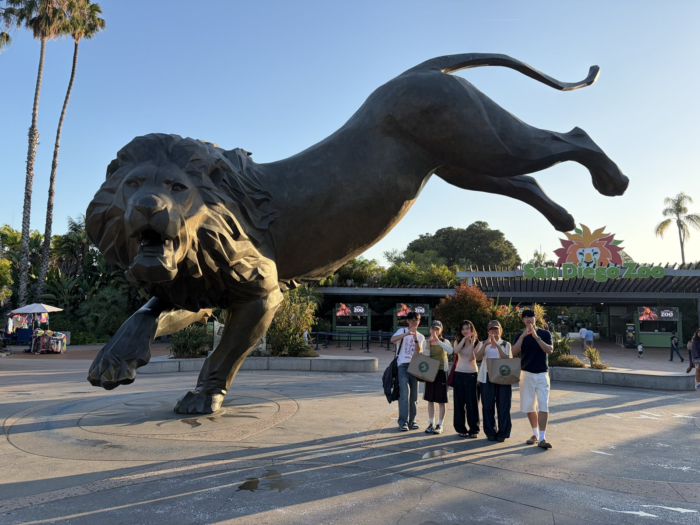

  

  
  

 

## Team

| Name | Role |
|---|---|
| 🐼 Yeonwoo Noh | Team Leader |
| 🐱 Junyup Lee | Tech Leader |
| 🦊 Cheoljun Yu | Backend |
| 🐹 Chaeryoung Hong | Frontend |
| 🐢 Jiwon Kim | Frontend, Backend |

  

 

## Service Introduction

**Skin Cancer Detector Through Photos (Image Classification)**

A service that analyzes user-uploaded photos of skin lesions using an AI image classification model to determine whether the lesion is suspicious for skin cancer.

> **Why "Dermalyze"?** *Derma* (skin) + *Analyze* — the name is literally what the service does.

 

## Links

- 📖 [README.md](./README.md) — project overview, live demo, tech stack
- 📋 [PRD.md](./PRD.md) — full product requirements document